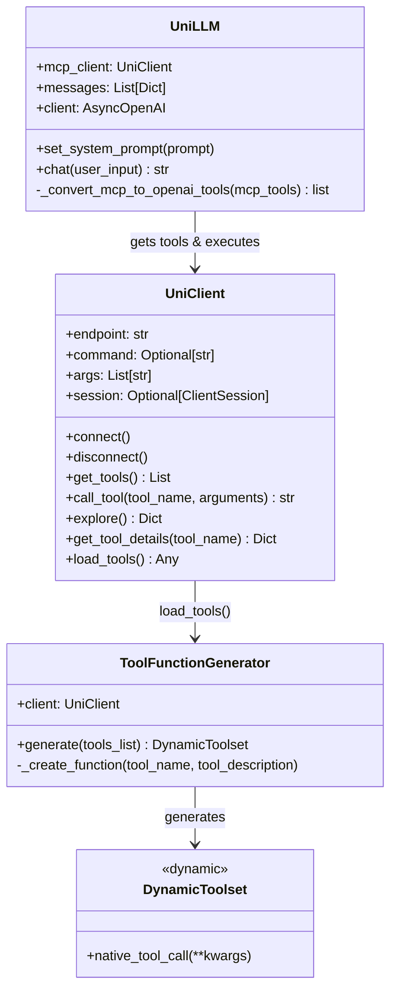
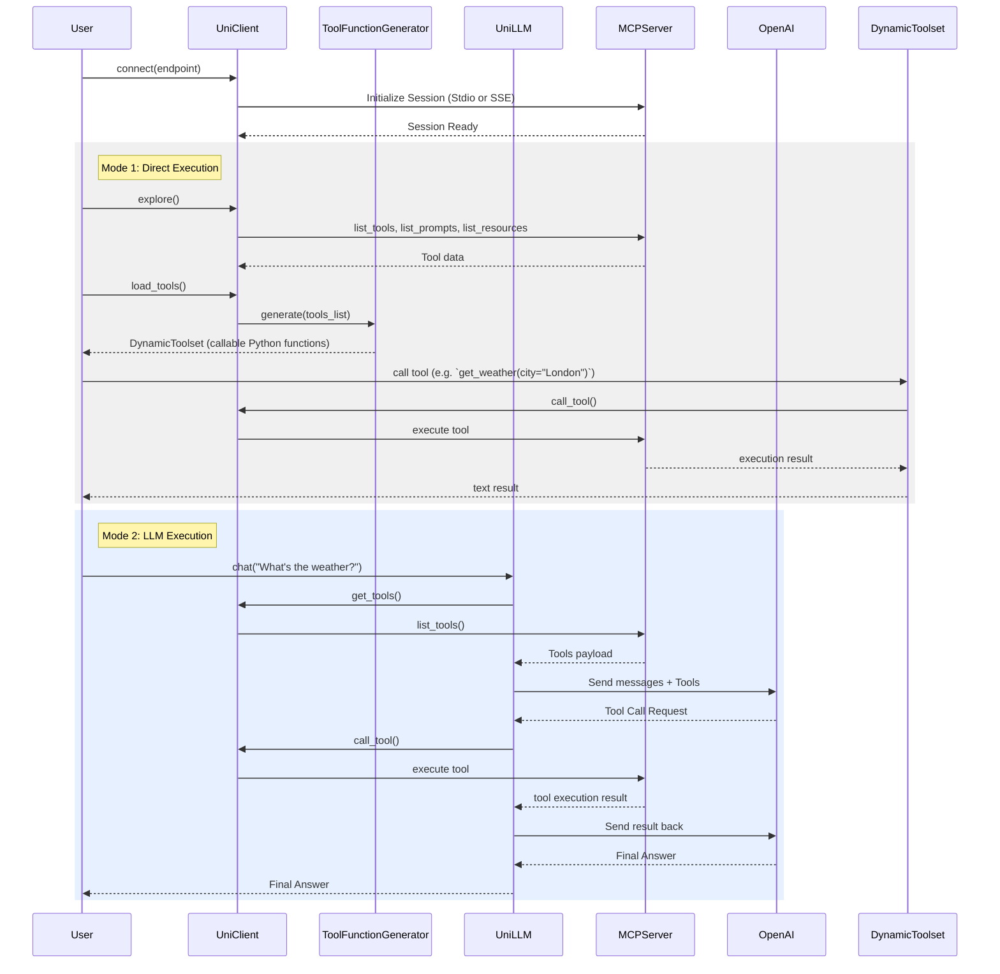

# UniMCP Architecture

## Overview
UniMCP is a Python-native, framework-agnostic client for interacting with Model Context Protocol (MCP) servers. The current implementation provides a unified interface to connect to MCP servers, explore their capabilities, dynamically convert MCP tools into callable Python functions, and interact with an LLM to autonomously trigger these tools.

## Core Architecture

The system is organized into a modular set of components that separate the client connectivity, dynamic generation of tools, and LLM orchestration.

## System Workflow Diagram

The sequence of connecting to a server, exploring tools, and utilizing them natively in Python or via an LLM.

## Current Component Details

### `unimcp.client.UniClient`
The primary connection interface to an MCP server.
- Supports both **Stdio Transport** (for local scripts/executables) and **SSE Transport** (for remote HTTP/HTTPS connections).
- Seamless connection and disconnection management via `AsyncExitStack`.
- Implements comprehensive tool exploration via `.explore()`, `.get_tool_details()`, and `.get_tools()`.
- Catches errors during connection and execution, mapping them to standard UniMCP exceptions.

### `unimcp.generator.ToolFunctionGenerator`
Dynamically transforms MCP protocol definitions into native Python methods.
- Accepts raw MCP tool responses and iterates over them.
- Creates asynchronous inner functions attached to a `DynamicToolset` object.
- Automatically handles argument passing from the native python function `kwargs` into the `call_tool` MCP payload.

### `unimcp.llm.UniLLM`
A bridging component connecting OpenAI-compatible APIs directly with the `UniClient`.
- Maps MCP tool schemas into OpenAI-compatible tool schemas on-the-fly.
- Handles the automated cycle of prompting the LLM, triggering required tool functions via the `UniClient`, and passing the context back to the LLM.
- Retains ongoing conversation history within the `messages` list.

### `unimcp.exceptions`
Contains dedicated custom exception classes to facilitate clean error handling:
- `ConnectionError`: Emitted when connection/initialization to an MCP server fails.
- `NotConnectedError`: Emitted when operations are performed before establishing a connection.
- `ToolNotFoundError`: Emitted when asking for details of an unknown tool.
- `ToolExecutionError`: Emitted when a tool executes and returns an internal server-side error, or crashes during execution.
