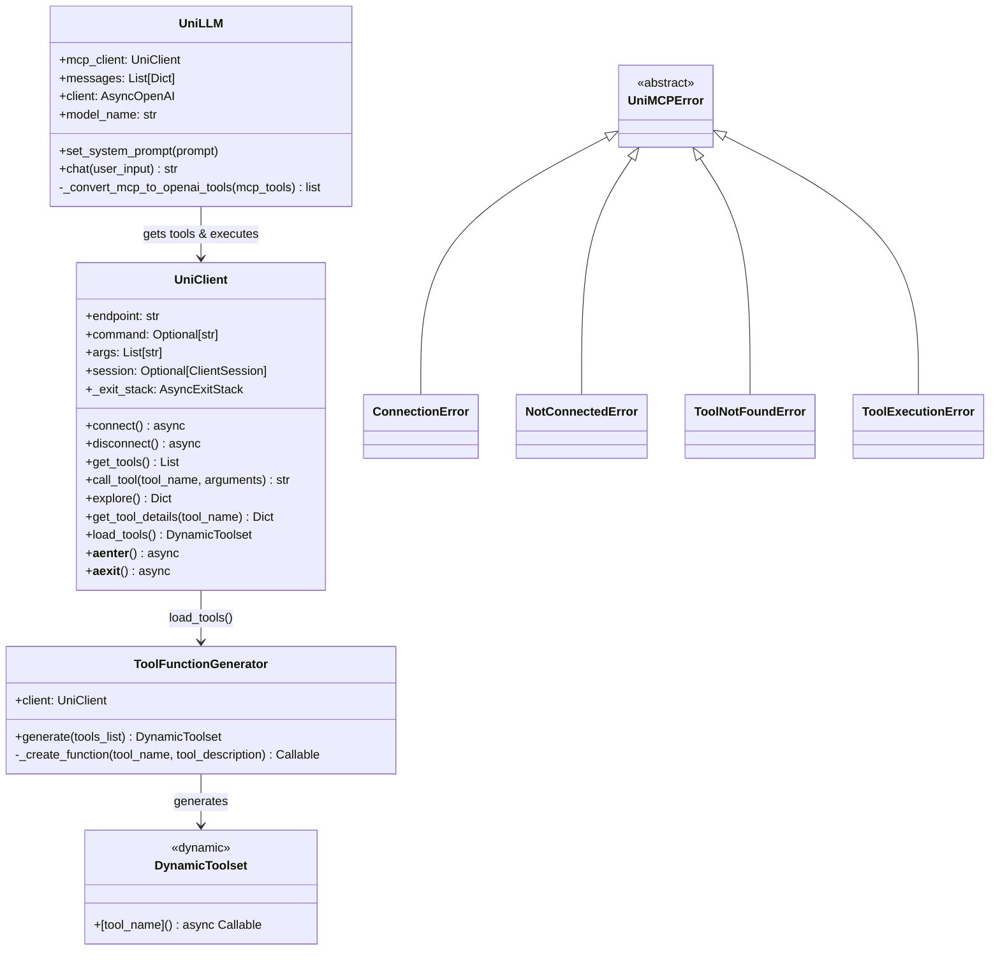
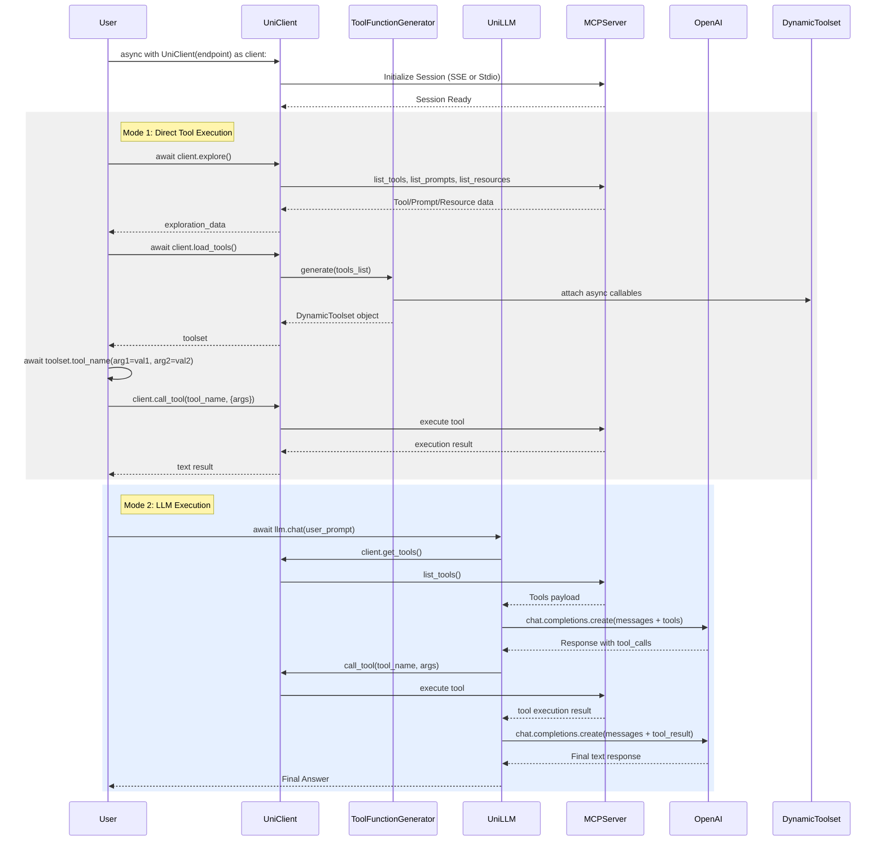

# UniMCP Architecture

## Overview
UniMCP (v0.2.0) is a Python-native, framework-agnostic client library for interacting with Model Context Protocol (MCP) servers. It provides a unified, easy-to-use interface that enables developers to:
1. **Connect to MCP servers** via SSE (HTTP/HTTPS) or Stdio (local process) transport
2. **Explore available tools** from the server and understand their schemas
3. **Call tools directly** as native async Python functions
4. **Integrate with LLMs** (OpenAI-compatible APIs) for autonomous tool invocation

The design prioritizes ease-of-use and Pythonic semantics, allowing developers to work with MCP tools as if they were regular Python functions.

## Core Architecture

The system is organized into modular components that separate concerns: client connectivity, transport handling, dynamic tool generation, and LLM orchestration.



## System Workflow Diagram

The sequence of connecting to a server, exploring tools, and utilizing them natively in Python or via an LLM.



## Current Component Details

### `unimcp.client.UniClient`
**Location**: [src/unimcp/client.py](src/unimcp/client.py)

The primary connection interface to an MCP server. Handles all server communication and tool execution.

**Key Features**:
- **Transport Support**:
  - **SSE (HTTP/HTTPS)**: For remote servers via URL (e.g., `http://localhost:8000/sse`)
  - **Stdio**: For local executables/scripts via command invocation (e.g., `server.py`, `node server.js`)
- **Connection Management**: 
  - Uses `AsyncExitStack` for reliable resource cleanup
  - Implements async context manager protocol (`__aenter__` / `__aexit__`)
  - Automatic connection inference based on endpoint format
- **Tool Discovery**: 
  - `explore()`: Lists available tools, prompts, and resources
  - `get_tools()`: Returns complete tool list with schemas
  - `get_tool_details(tool_name)`: Retrieves full schema for a specific tool
- **Tool Execution**:
  - `call_tool(tool_name, arguments)`: Executes a tool and returns text result
  - Includes error detection (isError flag) and error extraction from MCP response
- **Dynamic Tool Loading**:
  - `load_tools()`: Delegates to `ToolFunctionGenerator` to create Python callables
- **Error Handling**: Maps low-level errors to custom `UniMCP` exceptions

**Initialization Parameters**:
- `endpoint` (str): URL for remote servers or file path for local Stdio
- `command` (Optional[str]): Explicit command for Stdio (e.g., "python"). Auto-detected if not provided
- `args` (Optional[List[str]]): Additional CLI arguments for Stdio command

**Example Usage**:
```python
# Context manager usage (recommended)
async with UniClient("http://localhost:8000/sse") as client:
    tools = await client.get_tools()
    result = await client.call_tool("my_tool", {"param": "value"})

# Manual connection/disconnection
client = UniClient("server.py")
await client.connect()
# ... use client ...
await client.disconnect()
```

### `unimcp.generator.ToolFunctionGenerator`
**Location**: [src/unimcp/generator.py](src/unimcp/generator.py)

Dynamically transforms MCP tool schemas into native Python async methods.

**Key Components**:

1. **DynamicToolset** (Line 1-2):
   - A simple Python class that serves as a container for dynamically generated tool methods
   - Each method is attached at runtime with `setattr()`
   - No predefined attributes; entirely populated by `generate()`

2. **ToolFunctionGenerator**:
   - `generate(tools_list)`: 
     - Iterates over MCP tool definitions
     - Creates an async inner function for each tool
     - Attaches functions to `DynamicToolset` with tool name as attribute name
     - Returns populated toolset object
   - `_create_function(tool_name, tool_description)`:
     - Returns an async closure that captures `tool_name` and `tool_description`
     - Sets proper function name and docstring for IDE support
     - Delegates execution to `UniClient.call_tool()`

**Generated Function Behavior**:
```python
# After calling: toolset = await client.load_tools()
# Each tool becomes an async callable:
async def native_tool_call(**kwargs):
    return await self.client.call_tool(tool_name, kwargs)

# Usage:
result = await toolset.save_contact(name="John", phone="123")
```

### `unimcp.llm.UniLLM`
**Location**: [src/unimcp/llm.py](src/unimcp/llm.py)

A bridging component that connects OpenAI-compatible LLM APIs with MCP tools.

**Key Features**:

1. **Multi-Provider Support**:
   - Accepts `provider` parameter to auto-select base URL from known providers
   - Supported providers (from [src/unimcp/constants.py](src/unimcp/constants.py)):
     - openai (default)
     - groq, openrouter, together, deepseek
     - ollama, vllm, lmstudio (local)
     - xai, gemini
   - Priority order: explicit args > environment variables > defaults

2. **Tool Schema Conversion**:
   - `_convert_mcp_to_openai_tools()`: Transforms MCP tool definitions into OpenAI function calling format
   - Maps `name`, `description`, and `inputSchema` fields
   - Maintains full schema compatibility for validation

3. **Conversation Management**:
   - `messages` list: Maintains full conversation history (system, user, assistant, tool responses)
   - `set_system_prompt(prompt)`: Updates or inserts system prompt at message[0]
   - Persistent across multiple `chat()` calls for multi-turn conversations

4. **Autonomous Tool Execution Loop**:
   - `chat(user_input)`: 
     - Appends user message to history
     - Fetches available tools from MCP client
     - Calls LLM with tools enabled (`tool_choice="auto"`)
     - Parses tool calls from LLM response
     - Executes each tool via `UniClient.call_tool()`
     - Feeds results back to LLM (role="tool")
     - Loops until LLM returns final text response
     - Returns final text content

**Configuration Priority**:
```
Explicit Parameters > Environment Variables > Provider Defaults

Example:
UniLLM(
    mcp_client,
    api_key="sk-...",              # Takes precedence
    base_url="http://localhost",   # Over OPENAI_BASE_URL
    model_name="gpt-4o",           # Over OPENAI_MODEL
    provider="groq"                # Used if no explicit base_url
)
```

**Environment Variables Supported**:
- `OPENAI_API_KEY`: LLM API authentication
- `OPENAI_BASE_URL`: Base URL for API endpoint
- `OPENAI_MODEL`: Default model (fallback: "gpt-4o")

### `unimcp.exceptions`
**Location**: [src/unimcp/exceptions.py](src/unimcp/exceptions.py)

Custom exception hierarchy for clean error handling.

**Exception Classes**:

1. **UniMCPError** (Base Exception)
   - Root exception for all UniMCP errors
   - Inherits from Python's built-in `Exception`

2. **ConnectionError** (extends UniMCPError)
   - Raised when client fails to connect to MCP server
   - Triggered during `connect()` if initialization fails
   - Includes original exception details and endpoint information

3. **NotConnectedError** (extends UniMCPError)
   - Raised when operations are attempted before establishing connection
   - Prevents accidental misuse (e.g., calling `get_tools()` without connecting)

4. **ToolNotFoundError** (extends UniMCPError)
   - Raised when requesting details of non-existent tool
   - Triggered by `get_tool_details()` if tool_name doesn't match any available tool

5. **ToolExecutionError** (extends UniMCPError)
   - Raised when tool execution fails on the server
   - Covers two cases:
     - Server returns `isError=true` in response
     - Exception during tool invocation
   - Includes error message from MCP server

**Error Handling Pattern**:
```python
try:
    result = await client.call_tool("nonexistent", {})
except ToolNotFoundError:
    print("Tool doesn't exist")
except ToolExecutionError:
    print("Tool failed to execute")
except NotConnectedError:
    print("Not connected to server")
```

## Data Flow: Request to Response

### Direct Tool Calling Flow

```
User Code
  ↓
UniClient.call_tool(tool_name, args)
  ├─ Validates connection (session exists)
  ├─ Calls session.call_tool(tool_name, arguments)
  ├─ Receives CallToolResult from MCP
  ├─ Checks result.isError flag
  ├─ Extracts content.text from response
  └─ Returns tool_result_str
```

### LLM Tool Calling Flow

```
User Code: llm.chat(user_input)
  ↓
UniLLM.chat() Loop
  ├─ Get MCP tools via client.get_tools()
  ├─ Convert to OpenAI format
  ├─ Call LLM with tools
  ├─ LLM returns response (with or without tool_calls)
  ├─ If tool_calls exist:
  │  ├─ For each tool_call:
  │  │  ├─ Parse tool_name and arguments (JSON)
  │  │  ├─ Call client.call_tool(tool_name, args)
  │  │  ├─ Append tool result to messages
  │  │  └─ Loop back to LLM call
  └─ If no tool_calls: return response.message.content
```

## Transport Implementation

### SSE Transport (Remote Servers)
- Uses MCP's built-in `sse_client()` from `mcp.client.sse`
- Establishes HTTP/HTTPS connection to remote endpoint
- Creates read/write streams for bidirectional communication
- Endpoint detection: URLs starting with "http://" or "https://"

### Stdio Transport (Local Processes)
- Uses MCP's `stdio_client()` from `mcp.client.stdio`
- Spawns local process with `StdioServerParameters`
- Supports auto-detection:
  - `.py` files → runs with `python` command
  - `.js` files → runs with `node` command
  - Other paths → treated as executable command
- Supports explicit command override via `command` parameter
- Useful for local testing and development

## Module Organization

```
src/unimcp/
├── __init__.py                 # Exports: UniClient, UniLLM, __version__
├── client.py                   # UniClient class (SSE + Stdio support)
├── generator.py                # ToolFunctionGenerator, DynamicToolset
├── llm.py                       # UniLLM class (LLM orchestration)
├── exceptions.py               # Custom exception hierarchy
└── constants.py                # PROVIDER_BASE_URLS mapping
```

## Key Design Decisions

1. **Async-First API**
   - All I/O operations are `async` to prevent blocking on network/subprocess calls
   - Enables high-performance concurrent tool execution
   - Uses `AsyncOpenAI` for LLM calls to maintain concurrency
   - Trade-off: No built-in sync wrapper (requires `asyncio.run()` for sync code)

2. **Dynamic Function Generation Over Static Bindings**
   - Runtime tool discovery allows connecting to any MCP server without recompilation
   - No need for code generation or pre-defined tool classes
   - Schema-driven approach: tool names, parameters, and descriptions come from server
   - Enables Pythonic usage: `await tools.tool_name(arg=value)` instead of `call_tool()`

3. **AsyncExitStack for Resource Management**
   - Handles both SSE and Stdio transport cleanup reliably
   - Prevents resource leaks from half-initialized connections
   - Automatic cleanup even if connection fails mid-initialization

4. **Conversation History Persistence in UniLLM**
   - `messages` list is retained across `chat()` calls
   - Enables multi-turn conversations without reloading tools each time
   - User is responsible for conversation management (clearing, saving, loading)

5. **OpenAI-Compatible API Focus**
   - Supports any API using OpenAI's tool_calls format
   - Flexible via `base_url` and `provider` parameters
   - Minimizes dependency footprint (only `openai` package needed)
   - Future extensibility: Can add `LLMProvider` abstract interface for other backends

6. **Error Wrapping with Context**
   - MCP-level errors wrapped in custom `UniMCP` exceptions
   - Each exception includes original error message + context
   - Enables granular error handling in user code

## Current Limitations & Considerations

### Known Limitations in v0.2.0

1. **LLM Backend Limited to OpenAI-Compatible APIs**
   - Currently supports only APIs that implement OpenAI's chat.completions interface
   - Future: Could add abstract `LLMProvider` interface for flexibility
   - Would enable support for Anthropic Claude, local LLMs with different interfaces, etc.

2. **No Built-in Conversation Saving**
   - Conversation history stored only in memory
   - Users must manually save/load `llm.messages` for persistence
   - No session management utilities

3. **No Input Validation Before Tool Execution**
   - MCP tool schemas are available but not used for pre-validation
   - Errors only caught when server rejects the tool call
   - Could improve UX with JSON schema validation

4. **Minimal Tool Exploration UI**
   - `explore()` returns structured data but no pretty-printing
   - Users must manually format tool information for display
   - CLI playground mentioned in newarch.md not yet implemented

5. **No Streaming Support**
   - LLM responses wait for full completion before returning
   - Long-running tool executions block the response loop
   - OpenAI streaming API not utilized

6. **Limited Error Recovery**
   - Tool execution failures stop the LLM loop (ToolExecutionError propagates)
   - LLM cannot gracefully recover or retry failed tools
   - Could add retry logic or error recovery mechanisms

## Testing & Quality Assurance

**Test Coverage** (from [tests/](tests/) directory):
- `test_server.py`: Tests for UniClient connection and tool execution
- `test_llm_config.py`: LLM configuration and provider setup
- `test_gemini_endpoints.py`: Gemini API integration testing
- `test_errors.py`: Exception handling and error scenarios
- `test_stdio_client.py`: Stdio transport testing
- `sc.py`: Unknown purpose (possibly scratch/experimental)
- `user_data.json`: Test data fixture

## Dependency Tree

```
unimcp (0.2.0)
├── mcp (1.27.0)                  # MCP protocol implementation
├── openai (2.33.0)               # OpenAI client + async support
└── python-dotenv                 # Environment variable loading
```

## Performance Characteristics

- **Connection Startup**: Depends on transport (SSE: network latency, Stdio: process spawn time)
- **Tool Discovery**: Single MCP call to `list_tools()`, generally <100ms
- **Tool Execution**: Depends on MCP server and tool complexity
- **LLM Calling**: Network latency to LLM API (typically 1-5 seconds)
- **Memory**: Minimal per-client (session + tools list). Message history grows with conversation length

## Security Considerations

1. **API Key Management**
   - Keys can be passed explicitly or via environment variables
   - Users responsible for key rotation and access control
   - No built-in key encryption or vault integration

2. **MCP Server Trust**
   - Assumes MCP server is trusted (no sandboxing)
   - Tools execute with same permissions as Python process
   - User responsible for validating MCP server source

3. **LLM Hallucination Risk**
   - LLM could attempt to call non-existent tools
   - Current design: Caught by `get_tools()` validation in UniLLM
   - Future: Could add stricter tool call validation

## Architecture Alignment with MCP Spec

UniMCP implements the MCP client-side protocol:
- **Supported Features**: Tools, Prompts, Resources listing and invocation
- **Transport**: SSE and Stdio (as per MCP spec)
- **Tool Calling**: Full OpenAI tool_calls integration
- **Session Management**: Uses MCP's ClientSession directly
- **Error Handling**: Maps MCP protocol errors to custom exceptions

## Future Extensibility

The current architecture enables:

1. **Transport Abstraction** (proposed in newarch.md)
   - Could extract transport layer to support WebSocket, other protocols
   - Would require minimal changes to UniClient

2. **Tool Registry** (proposed in newarch.md)
   - Could add caching layer for tool lists
   - Tool search/filtering utilities
   - Tool versioning support

3. **LLM Provider Abstraction**
   - Base `LLMProvider` interface
   - Pluggable backends: OpenAI, Claude, Gemini, local LLMs
   - Provider-specific optimizations

4. **CLI Tool** (mentioned in README)
   - Interactive playground for tool exploration
   - Test tool execution with sample payloads
   - Save/load conversation sessions

5. **Structured Outputs**
   - Leverage MCP schema for JSON schema validation
   - Support OpenAI structured outputs mode
   - Type-safe tool execution

## Related Documentation

- [README.md](README.md): Usage guide and feature overview
- [newarch.md](newarch.md): Proposed clean architecture refactoring
- [PROJECT_CRITIQUE_AND_ROADMAP.md](PROJECT_CRITIQUE_AND_ROADMAP.md): Detailed critique and future roadmap
- [pyproject.toml](pyproject.toml): Package metadata and dependencies
