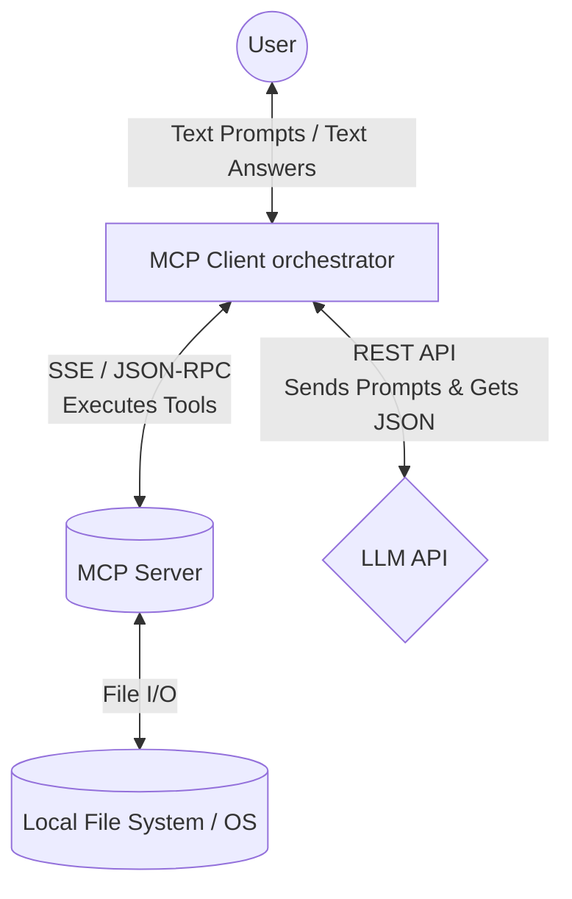
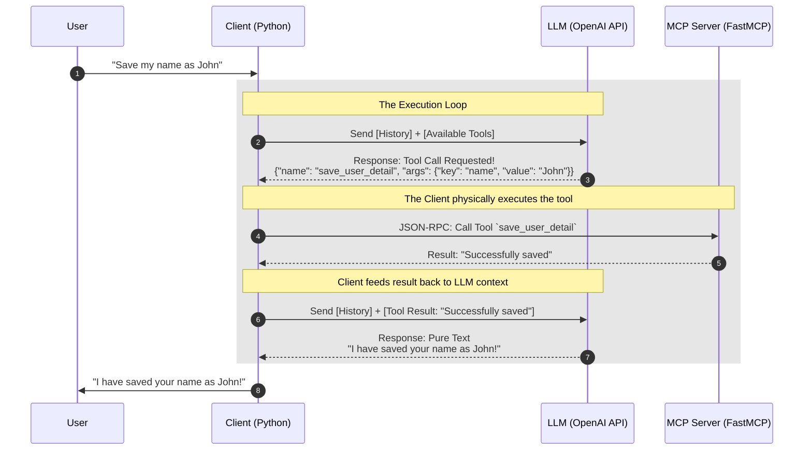

# MCP Client Architecture & Dataflow

This document explains exactly how our custom MCP Client (`client.py`) operates. 

A common misconception is that the "AI executes tools." **This is false.** An LLM is entirely isolated; it is merely a text predicting engine. It cannot access your file system or the internet on its own. 

The **Client** is the true powerhouse. It acts as the Orchestrator that sits in the middle of three entities:
1. **The User** (Providing prompts)
2. **The LLM** (Making decisions and formatting text)
3. **The MCP Server** (Performing actual programmatic actions)

---

## 1. High-Level Dataflow

---

## 2. Step-by-Step Breakdown of the Workflow

### Phase 1: Initialization & Tool Discovery
Before the user even types a message, the Client needs to figure out what the MCP Server can do.

1. **Connect:** The Client establishes an SSE (Server-Sent Events) connection to `http://localhost:8000/sse`.
2. **List Tools:** The Client asks the MCP Server, *"What tools do you have?"*
3. **Schema Conversion:** MCP SDK returns tool definitions in standard JSON-Schema format. The Client converts these into the strict `{"type": "function", ...}` schema format required by the OpenAI/LLM API.

### Phase 2: The Chat & Execution Loop
This is the core of the client design. It utilizes a continuous **loop-within-a-loop** architecture.

---

## 3. Why the Infinite Inner Loop? (`while True:`)

In `client.py`, you will notice an inner `while True:` loop wrapped around the LLM API call. Why do we need this?

**Because an LLM might need to chain multiple tools together to fulfill a single prompt.**

Imagine the user asks: *"What is my name, and what is my system OS?"*

1. **Iteration 1:** The LLM receives the prompt. It outputs a JSON token requesting to call `get_all_data`. 
2. The Client parses this, calls the server, and gets the JSON string back. The Client appends this to the message history.
3. **Iteration 2 (Inside the loop):** The Client immediately sends the updated history back to the LLM. The LLM reads the history, sees it now has the user's name, but realizes it *still* needs the OS. It outputs another JSON token requesting to call `get_system_status`.
4. The Client parses this, calls the server, gets the OS, and appends it to the history.
5. **Iteration 3 (Inside the loop):** The Client sends the history to the LLM *again*. This time, the LLM has all the pieces. It generates the final conversational text. 
6. The Client detects this is text (not a tool call payload), **breaks the inner loop**, and prints the final answer to the user.

## Summary

The LLM is just a brain that looks at the available functions and outputs JSON payloads saying *"I think you should run this function with these arguments"*. 

**The MCP Client:**
1. Parses those JSON requests.
2. Actually makes the network/local calls to execute the functions on the MCP Server.
3. Captures the physical output of the system.
4. Feeds that output back to the LLM so it knows what happened.